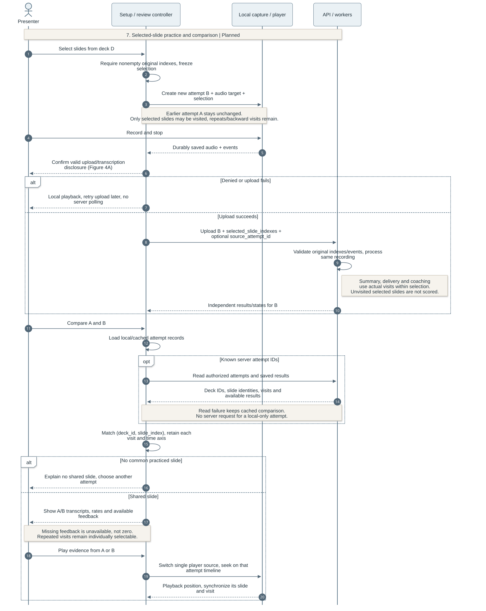

# OutLoud Design Documentation

Team 07 | Rev.4.3 | 9 October 2026

OutLoud is an Android presentation-rehearsal app. Presenters import PDF slides, record a rehearsal, and review their speech alongside the slides they visited. The design combines local recording and playback with server-side transcription and optional, user-requested AI coaching.

## 1. Document Revision History

| Version | Date | Description |
| --- | --- | --- |
| Rev.1.0 | 2026-09-28 | Initial architecture, data model and processing design. |
| Rev.2.0 | 2026-10-09 | Expanded recording, persistence, transcription, review and feedback design. |
| Rev.3.0 | 2026-10-09 | Added architecture and workflow diagrams; clarified component responsibilities and design rationale. |
| Rev.4.0 | 2026-10-09 | Reorganized around seven design sections; simplified API and recovery explanations; removed implementation tracking and references. |
| Rev.4.1 | 2026-10-09 | Added Iteration 1 features and technologies, observed outcomes, and real-voice transcription limitations. |
| Rev.4.2 | 2026-10-09 | Removed Iteration 1 evaluation outcomes from the design document to keep testing results separate. |
| Rev.4.3 | 2026-10-09 | Added mandatory requirement coverage, planned design beyond Iteration 1, and diagrams for proposed data, practice/comparison and deletion. |

### Contents

- [2. System Architecture](#2-system-architecture)
- [3. Database Design](#3-database-design)
- [4. Backend and API Design](#4-backend-and-api-design)
- [5. Recording, Transcription, and Slide Alignment](#5-recording-transcription-and-slide-alignment)
- [6. AI Feedback Design](#6-ai-feedback-design)
- [7. Frontend Architecture](#7-frontend-architecture)
- [8. Planned Design Beyond Iteration 1](#8-planned-design-beyond-iteration-1)
- [9. References and Maintenance](#9-references-and-maintenance)

### Scope and implementation status

This living design document covers the intended product in [Requirements & Specifications, Version 2.0](https://github.com/snuhcs-course/swpp-2026-project-team-07/wiki/Requirements-&-Specifications). Mandatory requirements remain mandatory when their implementation is incomplete. Section 8 proposes the remaining design for work beyond Iteration 1; it does not record team approval or completed features. Testing plans and results belong in separate Testing Documentation.

**Status legend, checked 9 October 2026:** **Merged** means the main-branch scaffold and standalone transcription/alignment and client foundations. **Unmerged** means the integrated PDF, capture, storage, transcription, review and coaching implementation in open PRs #17–21. **Local** means the staged controller/layout redesign on `codex/refactor-design`. **Planned** marks proposed components or changes; **Open** marks a decision still to resolve. Diagrams use these words, not line styles, for status. Dashed lines keep their usual reply, callback or relationship meaning.

| Requirement | Design sections | Remaining design or implementation work |
| --- | --- | --- |
| US-01: PDF import | [2](#2-system-architecture), [3](#3-database-design), [7](#7-frontend-architecture) | Apply owner-scoped storage and private media access in 8.5. |
| US-02: recording and slide visits | [5](#5-recording-transcription-and-slide-alignment), [8.3](#83-selected-slide-practice-and-comparison) | Add selected-slide scope and the pre-upload disclosure gate. |
| US-03: transcript, playback, key ideas | [5](#5-recording-transcription-and-slide-alignment), [8.1](#81-key-ideas-summaries) | Implement speech summaries with independent state and retrieval. |
| US-05: slide-specific feedback | [6](#6-ai-feedback-design), [8.3](#83-selected-slide-practice-and-comparison) | Limit coaching to practiced slides without renumbering them. |
| US-06: delivery feedback | [5](#5-recording-transcription-and-slide-alignment), [8.2](#82-delivery-analysis) | Add per-slide rates, filler flags and measured pause intervals. |
| US-07: audience-aware feedback | [6](#6-ai-feedback-design) | Preserve audience context and evidence; no new subsystem proposed. |
| US-08: retry selected slides and compare | [8.3](#83-selected-slide-practice-and-comparison) | Persist selection; add comparison over shared deck/slide identities. |
| US-10: history and recovery | [4](#4-backend-and-api-design), [5](#5-recording-transcription-and-slide-alignment), [7](#7-frontend-architecture) | Extend existing recovery to new analysis and deletion states. |
| US-11: delete attempts/decks | [8.4](#84-deletion-and-recovery) | Coordinate local/server cleanup, dependencies and active jobs. |
| NFR-05: privacy, consent, deletion | [8.4](#84-deletion-and-recovery), [8.5](#85-ownership-access-and-consent) | Add ownership, protected media and disclosure before upload; required before beta. |

Slide-description editing (US-13) remains optional, although the unmerged coaching implementation supports it. Audience-question practice, script attachments, team sharing and Korean product support (US-17–20) remain optional. They do not replace the mandatory work above. The course's detailed analysis of at least two implemented design patterns remains an Iteration 5 documentation requirement.

## 2. System Architecture

**Figure 1. System Architecture.** Unmerged integration with explicitly labeled planned responsibilities.

OutLoud uses a client-server architecture with separate responsibilities for capture, storage and analysis. The Android application handles PDF navigation, microphone recording and playback. The application imports PDF presentations and sends them to the backend for slide preparation. Rehearsal audio is saved locally before being uploaded with its corresponding slide-transition timestamps. Django prepares uploaded PDFs, stores rehearsals and accepts processing requests. The client retrieves progress and results through REST polling.

Celery workers perform transcription and feedback generation outside HTTP requests. Redis carries task messages, while PostgreSQL holds durable job state and results. The API and workers access the same server media volume, allowing workers to read uploaded files without transferring them through the queue. Celery Beat schedules recovery tasks that workers use to resume interrupted processing.

| Component | Technologies | Responsibility |
| --- | --- | --- |
| Android application | Expo, React Native, TypeScript, Expo Router | Navigation, feature state and screen rendering. |
| Device integrations | `react-native-pdf`, `expo-audio`, `expo-document-picker`, `expo-file-system`, `expo-sqlite` | PDF display, recording/playback, private files and local metadata. |
| Backend | Django REST Framework, Celery, Redis | HTTP interfaces, background processing and task delivery. |
| Media processing | pypdfium2, pypdf, Pillow; PyAV, Silero VAD with ONNX Runtime | Slide images/text, audio decoding and speech-presence detection. |
| AI providers | Hosted OpenAI Whisper; OpenAI or Gemini feedback APIs | Word-timestamped transcription, slide descriptions and coaching. |
| Server persistence | PostgreSQL and shared media storage | Relational data, structured results, jobs and media files. |

Local recording lets presenters rehearse and replay audio during network failures. Hosted inference avoids an on-device transcription model and keeps provider credentials on the backend, but introduces network dependence, latency and service cost. Whisper receives rehearsal audio; the selected feedback provider receives slide content and transcript context.

The planned additions use the same API, durable job storage and worker pool. Summary jobs consume saved speech; delivery jobs analyze words and audio intervals. Owner checks would protect both resource operations and media access. These additions extend the existing service boundaries rather than introducing a second backend. Section 8 defines their state and dependencies.

REST polling allows review to resume from saved state after the app closes. Compared with WebSockets, it requires less connection management at the cost of extra requests and delayed progress updates. Persisting jobs before queue delivery allows recovery when a notification is lost; revision checks prevent older background work from replacing newer results.

## 3. Database Design

### Core rehearsal data

**Figure 2. Core Database ER Diagram.**

A **Deck** represents a PDF presentation and owns an ordered collection of **Slides**. Each slide belongs to one deck, with a unique slide index within that deck. The PDF content hash and preparation version identify reusable slide preparation. One deck supports many **Attempts**, each representing a separate rehearsal with its own audio, duration, audience and slide timeline.

A new recording receives a new attempt UUID. Upload and processing retries retain that identity and its source audio, keeping retries within the same rehearsal. The current Attempt-to-Deck foreign key uses PROTECT, so ordinary deck deletion fails while attempts depend on it; several feedback relationships also use PROTECT. Slides use CASCADE. The planned deletion service in [8.4](#84-deletion-and-recovery) must remove dependents in order and clean their files; these relationships alone do not implement user-requested deletion.

Attempt stores slide events, transcript words, chronological visits and metrics as JSON. Review reads these structures together, so JSON avoids separate word and visit tables while preserving the complete timeline. This simplifies retrieval but requires service-level validation of structure and timing. Database file fields point to PDFs, audio and slide images in media storage. **ProviderRequest** associates a saved transcription response with an attempt's processing generation, supporting recovery without repeating completed inference.

### Slide descriptions and feedback

**Figure 3. AI Feedback Database ER Diagram.**

The feedback model separates reusable presentation knowledge from rehearsal-specific advice. A deck can have multiple **DescriptionSets**, distinguished by slide content and provider configuration, including model, prompt and schema versions. Each set holds descriptions and owns its **DescriptionJobs**. This prevents incompatible inputs from sharing cached descriptions.

An attempt has at most one **FeedbackAnalysis**, which groups successive **FeedbackJobs**. Each feedback job references a description set and retains the transcript context and description revision used to generate advice. **FeedbackRequest** belongs to either a description job or a feedback job and retains its provider response. These relationships preserve generation history and allow failed stages to recover independently.

Content revisions connect editable descriptions to dependent coaching. Changing a description makes advice based on the earlier revision stale. Retaining the previous generation supports traceability while regeneration produces advice from the updated content.

### Local and server storage

The device stores PDFs and recordings in app-private files. SQLite holds JSON records for the local catalog, capture checkpoints and cached review data. PostgreSQL remains authoritative for server jobs and generated results. Separating these stores keeps saved audio available offline while allowing analysis to continue on the server. Local checkpoints help recover interrupted capture when the native audio file remains playable.

### Proposed data-model extension

**Figure 3A. Proposed Data-Model Extension — Planned.** Figures 2–3 retain the current schema. This separate view shows the proposed additions needed by Sections 8.1–8.5; the names describe a design, not existing Django models.

An **Owner** would own Deck records; attempts and derived results inherit access through their deck. **AttemptSelection** would store the immutable original slide indexes chosen for one recording. **SummaryRun** and **DeliveryRun** would belong to an attempt and keep separate generation state, source digests and structured results. Multiple generations preserve recovery context; the API identifies the current compatible result rather than overwriting a newer generation with a late response.

**DeletionOperation** would retain an owner, target type/UUID, resource manifest and cleanup state. Its target identifier deliberately survives deletion of the target row. It is an operation record, not a new ownership link or a replacement for existing foreign keys. After cleanup, its receipt retains only identifiers and completion state, not rehearsal content. Tables and exact migration details remain provisional.

## 4. Backend and API Design

The backend separates HTTP handling from domain services. Views validate requests and serialize public results; services manage storage, transcription, alignment, descriptions and coaching. Celery tasks invoke those services for background work. PDF preparation occurs during deck upload, while external AI calls run outside HTTP requests and database transactions.

The following routes exist in the unmerged integration. All use the `/api/` prefix and trailing slashes; paths below are relative to that prefix.

| API group | Main routes | Responsibility |
| --- | --- | --- |
| Decks | POST `decks/`; GET `decks/{id}/` | Prepare/store PDFs and retrieve slide metadata. |
| Attempts | POST `attempts/`; GET `attempts/{id}/`; GET `decks/{id}/attempts/` | Store recordings, retrieve results and list rehearsal history. |
| Transcription | POST `attempts/{id}/process/` | Request transcription/alignment or retry processing. |
| Descriptions | GET/PATCH `decks/{id}/descriptions/`; POST `decks/{id}/descriptions/generate/` | Read, edit and generate reusable slide descriptions. |
| Coaching | GET `attempts/{id}/feedback/`; POST `attempts/{id}/feedback/generate/` | Retrieve feedback or request coaching. |
| Operations | GET `health/`; GET `ready/` | Check API liveness and database/broker connectivity. |

Recording upload uses multipart audio and JSON metadata containing the attempt identity, deck, duration, audience and slide events. Public interfaces use zero-based slide indexes and integer milliseconds relative to audio capture. TypeScript contracts and client validation connect these responses to frontend state.

Upload and processing are separate operations: storing a rehearsal preserves its media even if analysis fails. Read requests return saved state without starting generation. Background results expose progress, available data and retry eligibility, allowing review to display useful partial results and refresh server state after a connection failure.

### Proposed interface additions

These operations are **Planned**. Their route names are provisional and separate from the implemented table above. GET remains read-only; queued work would return its state for polling and reuse existing revision-aware admission/retry conventions.

| Proposed operation | Data or result | Purpose |
| --- | --- | --- |
| POST/GET `attempts/{id}/summaries/` | Independent summary state and visit-linked key ideas | Generate explicitly; retrieve cached speech summaries. |
| POST/GET `attempts/{id}/delivery/` | Metric availability, detection rules and timestamped events | Generate/retrieve delivery analysis independently of coaching. |
| Extend POST `attempts/` metadata | `selected_slide_indexes`, optional `source_attempt_id` | Freeze practice scope in a new attempt; preserve original deck indexes. |
| DELETE `attempts/{id}/` or `decks/{id}/` | Accepted deletion operation ID | Request confirmed, authorized cleanup. |
| GET `deletions/{id}/` | Server cleanup state and recoverable failure | Resume status after interruption; local cleanup has separate state. |
| Authenticated media retrieval | Owner-checked PDF, image or audio stream | Replace public development media URLs before deployment. |

Comparison would reuse existing history and attempt reads; it needs no additional AI call or dedicated comparison endpoint. Frontend contracts would add typed selection, per-category analysis state and deletion progress. Authentication applies to existing routes as well as new ones. The team must version these additive contracts and their caches together; older recordings without an explicit selection retain their recorded visit scope and never trigger new analysis merely because they reopen.

## 5. Recording, Transcription, and Slide Alignment

**Figure 4A. Recording and Durable Upload.** Unmerged capture/storage behavior with the planned pre-upload consent gate required by NFR-05.

The recording controller obtains microphone permission and starts an audio timeline with an initial slide event at zero. During capture, confirmed PDF page changes record the slide index and elapsed native audio time. Using audio-relative timestamps keeps navigation and speech aligned regardless of network delay or device clock changes.

Stopping a rehearsal finalizes the audio file and saves its metadata before any network transfer. In the target flow, the app explains transcription data transfer and obtains consent before sending the PDF/audio. Declining leaves the recording local; upload failure also leaves playback available, and upload retry uses the same attempt identity. This planned ordering protects the recording independently of backend availability.

The inspected unmerged client currently uploads first and asks for transcription consent before the processing request. Figure 4A shows the required correction as Planned; it is not a claim that the client already follows the target order. Feedback retains its separate disclosure and explicit request in Figure 5A.

**Figure 4B. Transcription, Alignment and Review.** Unmerged processing with planned consent enforcement and independent analysis extensions.

After the planned pre-upload disclosure is accepted and upload succeeds, the target flow initiates transcription and slide alignment automatically. Processing admission would check the recorded consent; legacy server attempts lacking it require disclosure before provider submission. Results are processed asynchronously and become available in the review interface. The API schedules background work, and the active review screen polls only after it knows a server attempt exists. Reopening a saved rehearsal retrieves existing state rather than repeating analysis.

The worker checks for speech before sending the original audio to hosted Whisper, which returns timestamped words. Recordings without detected speech retain their slide timeline with an empty transcript. The worker saves transcription before aligning words to slides, so a later alignment failure does not discard recognized speech. Recovery can reuse completed results; failures that need another provider call remain separate from local playback.

Planned summary and delivery jobs attach to saved audio/transcript/visits after this pipeline. They have their own states and explicit generation actions, so a summary or detector failure cannot turn a completed transcript into a failed recording. Section 8 describes their prerequisites and independent recovery.

### Word-start alignment and synchronized review

Slide events define chronological visits with half-open intervals `[start_ms, end_ms)`. The final visit ends at the recording duration. Each word belongs to the visit containing its **start time**. A binary search selects the latest transition at or before that time, assigning an exact-boundary word to the new visit.

For example, transitions to slides 0, 1 and 0 at 0, 4000 and 9000 ms produce three visits. A word starting at 4000 ms belongs to slide 1; one starting at 9000 ms belongs to the second visit to slide 0. Repeated and backward visits remain distinct, and the last event wins when transitions share a timestamp. A word crossing a transition stays intact in its starting visit.

This rule gives each word a deterministic place in the recorded navigation. During review, one native player's audio position drives slide selection and transcript highlighting. Tapping a word or feedback citation seeks that same player to the corresponding time. Recorded slide events still support synchronized slide playback when aligned text is unavailable.

## 6. AI Feedback Design

**Figure 5A. Feedback Generation and Description Reuse.** Unmerged coaching with a planned practiced-slide scope check (US-05, US-08).

AI coaching starts when the user requests feedback from a saved rehearsal. It uses the existing transcript, slide visits and audience context without transcribing the audio again. The backend attaches compatible cached descriptions or generates them before coaching. Slide descriptions interpret images and extracted text; they describe presentation content rather than summarize what the presenter said.

Separating descriptions from coaching avoids interpreting unchanged slides for every rehearsal. The cache accounts for both source content and generation configuration, trading additional version management for lower latency and fewer provider calls. Backend provider adapters support OpenAI or Gemini through a common service boundary, keeping provider-specific requests out of the app.

Coaching produces suggestions about consistency, clarity and audience fit. Each suggestion links slide evidence to a passage within one recorded visit. The backend validates source identities, transcript quotations and word positions, then derives playback times from the saved transcript. The client checks that evidence belongs to the loaded rehearsal before enabling navigation. These checks establish traceability; they do not guarantee that the advice is semantically correct. A valid response can also contain no suggestions.

**Figure 5B. Description Edits, Invalidation and Retry.** Unmerged optional description editing (US-13); planned retries retain the attempt's practiced-slide scope.

Users can correct slide descriptions before requesting new advice. An edit creates a newer content revision, prevents older generation work from overwriting it, and makes dependent feedback stale. The interface disables stale evidence actions until regeneration. This keeps editable presentation knowledge consistent with the coaching that relies on it.

Description generation and coaching retain separate job state, allowing a retry to reuse successful earlier work. Saved provider responses support recovery where possible. If a submitted request has an uncertain outcome, retry requires confirmation to avoid silently repeating a potentially completed, chargeable operation. Feedback failure leaves the rehearsal audio and transcript available for review.

For selected-slide practice, the planned coaching snapshot includes the immutable selection and filters provider context and evidence to visited slides within it. Original slide indexes remain intact. Deck descriptions may remain reusable across rehearsals; missing-description work can use the existing whole-deck cache, but coaching must not flag slides outside the attempt scope as omitted speech. Current validators assume a complete ordered deck, so scope filtering belongs in a new validated projection rather than a renumbered replacement deck. Regeneration after description edits uses the same attempt scope.

## 7. Frontend Architecture

**Figure 6. Frontend Architecture.** Local controller/layout redesign over unmerged services; planned responsibilities remain with controllers.

The frontend separates navigation, feature behavior and presentation. Expo Router passes route context to feature hosts. Their controllers own application state and coordinate recording, playback, persistence and API clients. Replaceable layouts render the state and invoke controller-provided actions. This separation allows the interface to evolve without duplicating the underlying rehearsal behavior.

| Feature controller | Owned state and behavior |
| --- | --- |
| Library | PDF import, presentation catalog and rehearsal history. |
| Setup | Selected deck/page, audience and readiness to record. |
| Recording | Microphone lifecycle, slide timing and durable save. |
| Saved review | Shared playback, transcript state and analysis requests. |
| Feedback | Generation progress, description drafts and evidence navigation. |

Home emphasizes importing and opening presentations; Practice groups saved attempts by deck. Saved review offers Overview, Slides and Transcript panels around a shared player. Playback and feedback state belong to the review host, so changing panels preserves the audio position and description drafts. Feedback evidence opens the relevant slide and seeks through the same playback controls used by the transcript.

Typed layout contracts expose display models, available actions and native PDF/audio surfaces. Layouts do not own recorder, player, storage or network clients. A layout selection at startup connects views to the same feature hosts; keeping native surfaces mounted preserves active capture and playback during view updates.

Shared services handle local persistence and backend communication beneath the controllers. Native libraries provide PDF and audio capabilities through these boundaries. The design requires maintaining contracts as features change, but confines visual changes to views and keeps lifecycle and recovery behavior in one place.

The planned setup controller owns slide selection; review owns key-ideas and delivery states, comparison selection and the single active player. Library/review controllers coordinate confirmation and deletion progress through shared persistence/API services. Layout contracts expose these states and actions to replaceable views, keeping media, network and cleanup logic out of rendering components.

## 8. Planned Design Beyond Iteration 1

These **Planned** designs address mandatory work beyond Iteration 1, intended for Iteration 2. Provisional choices guide implementation; **Open** decisions still need team agreement.

### 8.1 Key-ideas summaries

**US-03; AC-03b–e.** Proposed flow: the presenter selects **Generate key ideas** after transcription/alignment is available, accepts disclosure for sending recognized speech to the configured provider, and the API admits an independent SummaryRun. A Celery service groups words by chronological visit, asks the existing provider adapter for concise speech summaries, validates visit/word references, and saves structured output for retrieval. The provider receives the recognized speech for the relevant visits; slide descriptions are not substitutes for what the presenter said.

SummaryRun would record the attempt, transcript digest, selection digest, model/prompt version, generation and state. Each result retains the original `slide_index`, chronological `visit_id` and supporting word indexes; playback times derive from saved words. Repeated visits remain separate, with each slide's Key ideas view listing its visits in time order. The original transcript stays verbatim. A changed transcript makes derived summaries stale; incompatible source/selection digests cannot reuse cached output; editing a slide description alone does not, because this summary depends on speech.

Summary states are not requested, queued/running, available, no recognized speech, failed and stale. An empty transcript produces **No speech recognized** without a provider call or slide-description fallback. Missing transcription means **Transcript unavailable**; provider failure means **Summary unavailable**, with independent retry and audio/transcript intact. Reopening reads cached output and starts no paid work. **Open:** confirm the generation trigger, summary length and provider configuration. Reference validation cannot establish paraphrase or transcript accuracy.

### 8.2 Delivery analysis

**US-06; AC-06a–e.** A proposed delivery service extends the timing/metrics boundary and stores a DeliveryRun separate from AI coaching. The review controller's explicit feedback action can request delivery analysis and coaching as independent jobs, displaying either result even if the other fails. The current Silero gate returns only a speech-presence boolean. Delivery analysis requires speech intervals and word-level processing in addition to that gate.

For English-first per-slide pace, count recognized words assigned by the existing word-start rule and divide by that slide's total visited duration in minutes. Sum counts and durations across repeated visits before division; do not average visit rates. Preserve each visit for playback. Zero duration or no valid recognized speech produces an unavailable rate. This extends the existing per-slide durations and whole-recording rate estimate; it does not claim a speaking-only rate.

The provisional filler rule matches standalone English **um** and **uh** in timestamped recognized words. Store each candidate's word reference and audio interval, label it **Transcript-detected filler**, and keep ambiguous words such as “like” outside this first rule. The provisional pause rule uses gaps of at least **1,000 ms between detected speech intervals**, excluding leading/trailing silence. Decode the original audio without trimming or concatenating it; clip intervals to the recording duration. Store detector version and threshold with the result. A pause crossing a slide change has one event ID and links to each overlapping visit, avoiding duplicate event counts while preserving slide navigation.

Each category has an availability state. Successful detection with no candidates returns an empty list; failure, missing timestamps or unsupported input returns unavailable, not zero. No detected speech makes internal pauses unavailable. Errors can miss or misplace events, so flags remain playback-linked candidates. Rules keep timing explainable. **Open:** filler vocabulary, ambiguous fillers and pause thresholds. The recognizer may omit fillers; audio-based detection or a disfluency-preserving recognizer may be needed to satisfy the mandatory feature reliably.

### 8.3 Selected-slide practice and comparison

**US-08; AC-08a–e; US-05 AC-05c.** Setup would store a nonempty selection of original deck slide indexes, initially in deck order. Choosing the whole deck expands to all indexes. AttemptSelection freezes that list when capture starts, and both navigation and upload validation reject visits outside it. The recorder still records confirmed page changes in audio-relative integer milliseconds, including backward and repeated visits within the selection.

**Figure 7. Selected-Slide Practice and Same-Slide Comparison — Planned.** The flow connects a new recording to review of the same slide in an earlier attempt, while keeping their media and time axes independent.

Every new capture gets a new attempt UUID and audio file. An optional `source_attempt_id` records where focused practice began; deleting that source would clear the reference without deleting the newer attempt. Upload retry and processing retry keep the new attempt's own ID. Analysis uses actual visits within the frozen selection, and cannot treat excluded slides as missing explanations. A selected but unvisited slide remains distinguishable from a visited slide with no recognized speech.

A comparison controller loads two authorized attempt results and intersects actual visited identities `(deck_id, slide_index)`. It shows earlier/later labels, available audio, transcript, feedback and visit lists side by side. It aggregates time per slide but retains each visit for seeking. One shared player switches between attempts, retaining separate positions and allowing only one recording to play at a time. Matching slide numbers from different decks is forbidden; the app explains an empty intersection. Missing feedback stays labeled while available audio/text remain reviewable. Selection metadata may be absent on older recordings; their actual visits still support comparison.

Reusing saved results avoids repeat inference and leaves earlier attempts unchanged. No automatic improvement score is proposed. **Open:** whether users may reorder the selection, and whether a later deck-version feature should support explicit cross-version mapping. The initial proposal keeps deck order and compares only the same uploaded deck.

### 8.4 Deletion and recovery

**US-11; AC-11a–c; NFR-05.** The library/review controller would show the named attempt, or the deck and its affected attempts, before confirmation. Cancellation changes nothing. Confirmation writes a local deletion journal, stops playback/uploads for the target and submits an owner-authorized request when online. For server-backed data, the UI distinguishes pending server deletion from completion; deleting a local-only recording needs no server request.

**Figure 8. Confirmed Deletion and Recovery — Planned.** A durable cleanup operation coordinates database rows, files and device caches. It also prevents delayed jobs from recreating deleted results.

The API would atomically mark the target as deleting, record a resource manifest in DeletionOperation, and block new attempts, processing, downloads and updates for that target. Workers must check this marker before provider submission and before saving any response; late results are discarded. Best-effort queue cancellation alone is insufficient. A submitted provider request may finish remotely; the app must not promise that cancellation erases a provider's retained copy.

Cleanup would remove private provider responses and content-bearing snapshots, dependent feedback/summary/delivery jobs and results, then attempts and their audio. Attempt deletion retains the deck and reusable deck descriptions needed by other attempts. Deck deletion removes all its attempts first, then description jobs/sets, slide rows/images and the PDF. This explicit order resolves the current PROTECT relationships rather than silently changing them to CASCADE. Quota reservations must be released/reconciled before their request rows are removed; content-free accounting may remain.

File removal runs from a durable manifest, outside database transactions. Each retry checks what remains, treating an already removed owned file as complete and leaving unrelated files alone. The device purges capture checkpoints, downloaded audio, analysis/history caches and matching shared-player state; it removes a cached PDF only when no surviving local reference needs it. The user's original PDF outside app-owned storage is untouched. An offline device records pending server cleanup and blocks re-upload; other devices reconcile deletion markers when they next connect.

Completion requires server cleanup and the requesting device's local cleanup, reported separately until both finish. Partial failure remains visible as **Deletion incomplete** with resumable cleanup; a failed refresh cannot resurrect deleted local content. The operation receipt keeps only the identifiers needed to prevent stale replay. **Open:** receipt/tombstone retention, backup erasure policy and provider retention terms; immediate deletion from disconnected devices or external provider backups is not promised.

### 8.5 Ownership, access and consent

**NFR-05; supports US-01, US-03, US-08 and US-11.** The current Compose pilot has no user authentication or ownership enforcement and exposes development media routes. Proposed protection must precede a multi-user deployment. Use a server-side Owner record keyed to a stable identity-provider issuer/subject; the client supplies a token, not an owner ID it can choose. A provisional managed OpenID Connect sign-in with PKCE would let Django validate the token and map requests to that Owner. Native secure storage would hold credentials; it is a planned dependency.

Deck would gain an owner reference. Attempts, descriptions, jobs and results inherit authorization through that deck; deletion receipts retain their owner for later status reads. Every read, upload, process request, edit and deletion would check this relationship. Owner scope also changes the current global PDF deduplication constraint to `(owner, content_hash, preparation_version)` and isolates device caches by API, owner and resource. Existing pilot data requires an explicit migration/claim decision; it cannot become globally visible or silently belong to the first account.

PDFs, images and audio would remain in private server storage. The API would stream media only after ownership checks, replacing unauthenticated development URLs. UUIDs alone are not authorization. Sign-out/account switches clear credentials and active views; account-scoped caches cannot appear under another account. A signed-in owner may continue recording offline, but upload waits for valid authorization. Uploading pre-account local captures requires an explicit association with the signed-in owner.

As shown in Figures 4A–4B, the target app presents the transcription disclosure before any recording-related PDF/audio transfer, records the accepted disclosure version/provider and allows cancellation with local playback intact. Processing admission checks that consent. A different analysis provider or changed data use requires a new disclosure. Feedback keeps its own explicit request and disclosure; speech summaries likewise disclose transcript transfer before generation. On-device rendering and server-side delivery measurement create no implied permission for external AI processing.

Ownership and authenticated media checks place access control at the shared API boundary rather than relying on screen visibility. **Open:** identity provider, token lifetime/revocation, handling local caches after sign-out, pilot-data migration and provider-retention policy. These choices remain proposals, while owner privacy, pre-upload consent and user-requested deletion remain mandatory.
