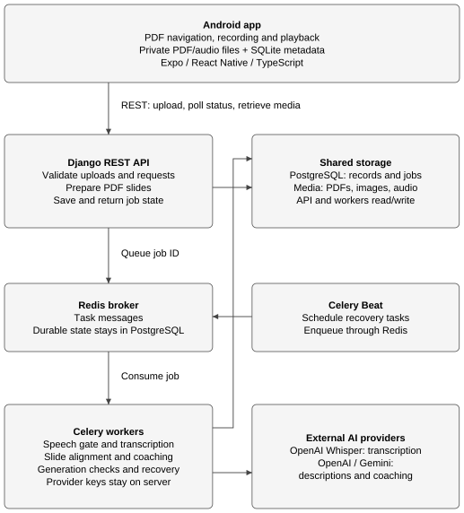
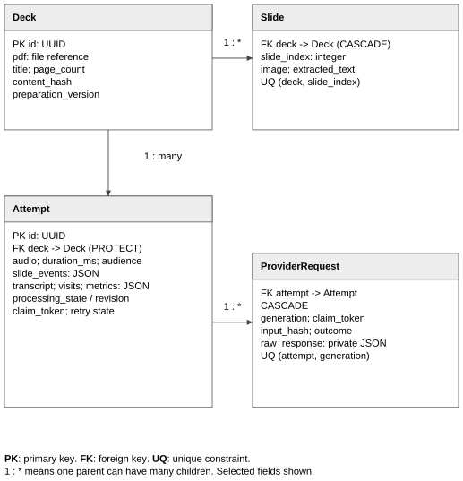
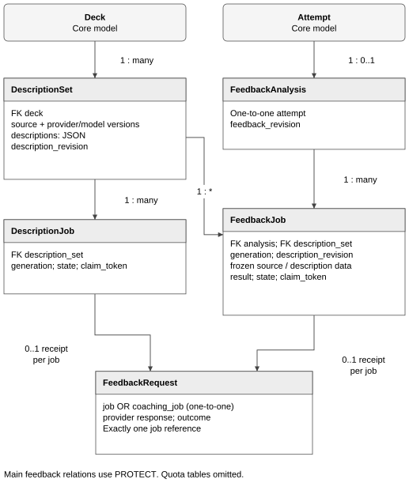
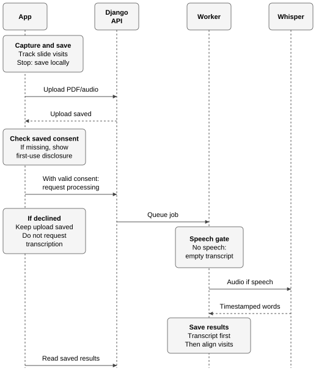
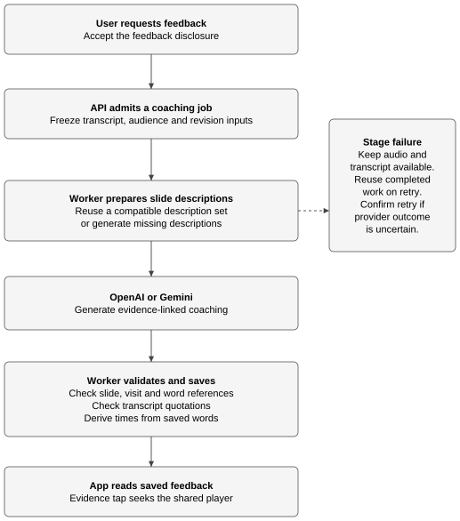
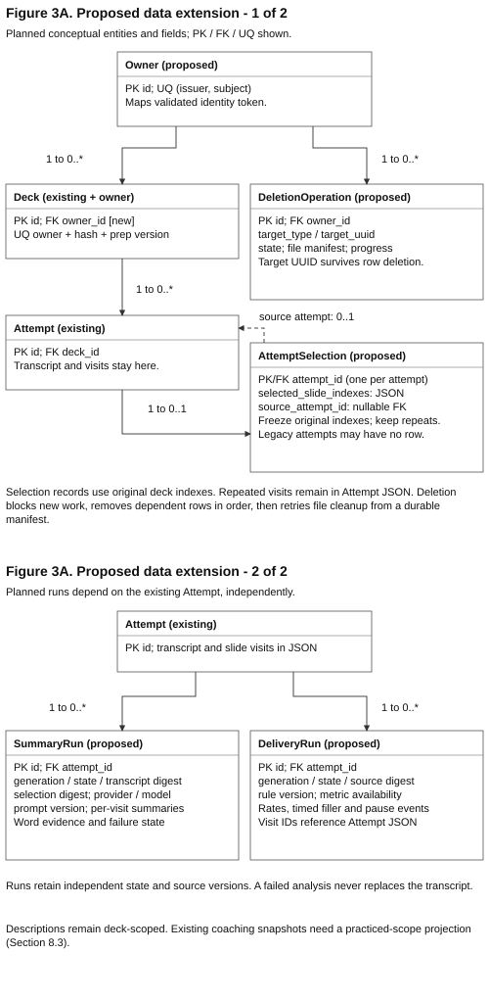
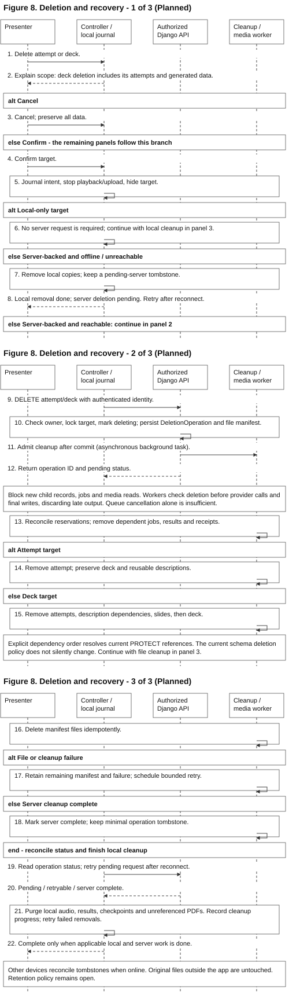

# OutLoud Design Documentation

Team 07 | Rev.2.0 | Iteration 1 | 9 October 2026

OutLoud is an Android app for rehearsing presentations with PDF slides. It saves recordings and slide visits, transcribes speech, and links feedback to the relevant audio and slide.

## 1. Document Revision History

| Version | Date | Description |
| --- | --- | --- |
| 1.0 | 2026-09-28 | Initial design. |
| 2.0 | 2026-10-09 | Iteration 1 design. |

Iteration 1 features are in review (PRs #17–21). Section 8 is planned design.

## 2. System Architecture

**Figure 1. System architecture.**

The Android app records and replays locally. Django accepts uploads, prepares PDF slides and serves saved state. Celery workers run transcription and coaching; Redis carries task messages. PostgreSQL stores metadata and job state, while a shared media volume stores PDFs, slide images and audio. The API and workers access that same volume, so queue messages carry job identifiers rather than media files. Celery Beat schedules recovery work through Redis.

The app uploads PDF/audio and slide events over REST, then polls for results. Workers send audio to hosted Whisper and slide/transcript context to the selected coaching provider. Provider credentials stay on the server. Local storage keeps recordings playable during network or analysis failures.

| Layer | Main libraries and services |
| --- | --- |
| App | Expo, React Native, TypeScript, Expo Router |
| Device files and media | react-native-pdf, expo-audio, expo-document-picker, expo-file-system, expo-sqlite |
| Backend | Django REST Framework, Celery, Redis, PostgreSQL |
| PDF and audio processing | pypdfium2, pypdf, Pillow, PyAV, Silero VAD, ONNX Runtime |
| External AI | OpenAI Whisper (`whisper-1`); OpenAI or Gemini for descriptions and coaching |

### Key design decisions

| Decision | Choice | Alternative | Why |
| --- | --- | --- | --- |
| Client-server or on-device | Local capture/playback; server analysis | Run all analysis on the phone | Keeps model downloads and provider keys off the phone; analysis needs a network and server resources. |
| Progress updates | REST polling of saved state | WebSocket connection | Review can resume after the app closes with less connection management; polling adds requests and update delay. |
| Timeline persistence | JSON fields for events, words, visits and metrics | Separate row for each word/visit | Review reads the timeline together; JSON reduces joins but needs service validation. |
| Description cache | Slide source plus provider/project, model, prompt and schema versions | Cache only by deck ID | Reuses compatible descriptions across attempts without mixing changed content or configurations; requires version management. |
| Concurrent jobs | Durable job state, generation and claim tokens | Rely on queue delivery alone | Duplicate or late workers cannot overwrite a newer generation; recovery checks add state-handling work. |
| Transcription | Hosted Whisper | Local Whisper model | Avoids operating local inference hardware; introduces external transfer, latency and usage costs. This choice does not establish transcript accuracy. |
| Speech gate | Silero VAD through ONNX Runtime | Handwritten amplitude threshold | Uses an existing speech detector before transcription; adds model/runtime dependencies and may miss speech. The current gate returns presence, not pause events. |
| Coaching integration | Common OpenAI/Gemini adapter with provider-specific requests | Provider calls spread through feature code | Keeps UI and job logic independent of provider payloads; each adapter still needs schema and error handling. |
| Save order | Finalize private audio and metadata before upload | Upload before durable local save | Preserves playback and a stable retry identity offline; needs device storage and upload recovery. |

See the [processing and feedback contracts](https://github.com/snuhcs-course/swpp-2026-project-team-07/blob/ce9f248256b1bbfc0d66f139886503261cc25953/docs/api-contract.md) for the interfaces behind these decisions.

## 3. Data Model

### Core rehearsal data

**Figure 2. Core rehearsal data.**

A Deck contains ordered Slides and supports multiple Attempts. Each new recording gets a new attempt UUID. Upload and processing retries retain that UUID and its audio. ProviderRequest stores a private transcription receipt for a processing generation, allowing recovery to reuse a saved response.

| Structure | Meaning |
| --- | --- |
| Slide event | Original zero-based slide index and integer audio-relative timestamp in milliseconds. |
| Transcript word | Recognized text with start and end times on the same audio timeline. |
| Visit | One chronological stay on a slide; repeated and backward visits remain separate. |
| Attempt | Audio, duration, audience, events, transcript, visits, metrics and processing state. |
| ProviderRequest | Private provider response and processing-generation record. |

The device keeps PDFs/audio in app-private files and metadata in SQLite. PostgreSQL holds server records; file fields point to shared media storage. A local checkpoint supports interrupted-capture recovery when the native audio file remains playable. Services validate JSON structure and time ranges before storing or returning the timeline.

**Constraints.** `(deck, slide_index)` is unique. `(content_hash, preparation_version)` identifies reusable PDF preparation. Attempt-to-Deck uses PROTECT; Slide-to-Deck and ProviderRequest-to-Attempt use CASCADE. Deleting a deck with dependent attempts requires the cleanup service proposed in [8.4](#84-deletion-and-recovery).

### Feedback data and caching

**Figure 3. Feedback data.**

The backend keeps reusable slide descriptions separate from advice about a recording. A deck can have multiple DescriptionSets for different source/provider configurations. An attempt has at most one FeedbackAnalysis, which groups its coaching generations.

| Model | Responsibility |
| --- | --- |
| DescriptionSet | Cached slide descriptions and their content revision. |
| DescriptionJob | One generation of a description set. |
| FeedbackAnalysis | Coaching history for one attempt. |
| FeedbackJob | One coaching generation with frozen transcript and description inputs. |
| FeedbackRequest | Private provider receipt for one description job or coaching job. |

Description edits increment a content revision and make dependent feedback stale. Regeneration uses the new revision. FeedbackRequest belongs to exactly one job type, and each job has at most one receipt. Main feedback relationships use PROTECT; quota buckets and reservations coordinate provider limits. The [Django models](https://github.com/snuhcs-course/swpp-2026-project-team-07/blob/ce9f248256b1bbfc0d66f139886503261cc25953/backend/rehearsals/models.py) define the full constraints.

## 4. Backend API

Routes use `/api/` and trailing slashes. Views validate and serialize requests; domain services handle storage and analysis. Celery invokes those services for background jobs. PDF preparation runs during deck upload; external AI calls run outside HTTP requests and database transactions.

| Routes | Purpose |
| --- | --- |
| POST `decks/`; GET `decks/{id}/` | Store/prepare a PDF and read slide metadata. |
| POST `attempts/`; GET `attempts/{id}/`; GET `decks/{id}/attempts/` | Store a recording, read results and list history. |
| POST `attempts/{id}/process/` | Start transcription/alignment or request a processing retry. |
| GET/PATCH `decks/{id}/descriptions/`; POST `decks/{id}/descriptions/generate/` | Read, edit or generate slide descriptions. |
| GET `attempts/{id}/feedback/`; POST `attempts/{id}/feedback/generate/` | Read or request coaching. |
| GET `health/`; GET `ready/` | Check API liveness and database/broker connectivity. |

Recording upload contains multipart audio and JSON metadata: attempt UUID, deck UUID, duration, audience and slide events. Upload stores media; a separate processing request starts analysis. GET requests only read saved state. Processing responses expose progress, partial results and retry eligibility. Client validation checks resource IDs and response structure.

### Proposed interfaces

These operations support Section 8. **Route names and new fields are provisional.** Queued work would return state for polling and use revision-aware admission/retry rules.

| Proposed operation | Data or result | Purpose |
| --- | --- | --- |
| POST/GET `attempts/{id}/summaries/` | Summary state and visit-linked key ideas | Generate explicitly; retrieve cached speech summaries. |
| POST/GET `attempts/{id}/delivery/` | Metric availability and timestamped events | Generate/retrieve delivery analysis independently of coaching. |
| Extend POST `attempts/` metadata | `selected_slide_indexes`, optional `source_attempt_id` | Freeze practice scope in a new attempt. |
| DELETE `attempts/{id}/` or `decks/{id}/` | Accepted deletion operation ID | Request confirmed, authorized cleanup. |
| GET `deletions/{id}/` | Cleanup state and recoverable failure | Resume deletion status after interruption. |
| Authenticated media retrieval | Owner-checked PDF, image or audio stream | Replace public development media URLs. |

Comparison reuses history and attempt reads; it needs no new AI call or dedicated endpoint. Authentication would apply to existing routes as well as new ones. Frontend contracts and caches must evolve together; older attempts without selection metadata retain their recorded visit scope.

The [API contract](https://github.com/snuhcs-course/swpp-2026-project-team-07/blob/ce9f248256b1bbfc0d66f139886503261cc25953/docs/api-contract.md) contains payloads, response examples and errors; [route definitions](https://github.com/snuhcs-course/swpp-2026-project-team-07/blob/ce9f248256b1bbfc0d66f139886503261cc25953/backend/rehearsals/urls.py) identify their handlers.

## 5. Recording, Transcription and Alignment

**Figure 4. Recording and transcription.**

The app requests microphone permission and records the initial slide event at `0 ms`. Confirmed slide changes use the native audio clock. Stop finalizes the audio and saves the attempt before upload. Permission denial prevents capture; upload failure leaves local playback available and permits retry with the same attempt ID.

The current order is local save, PDF/audio upload, then the saved first-use OpenAI disclosure before requesting transcription. Acceptance enables automatic transcription for later new recordings on that device. Cancellation leaves the server upload saved without transcription. Opening an older recording does not start analysis.

The API persists queued intent before task delivery. The active review screen polls only when a server attempt exists. A worker checks for speech, sends speech-containing audio to hosted Whisper and saves timestamped words before alignment. No detected speech produces an empty transcript with the slide timeline intact. Recovery can reuse a saved provider response or transcript; a failed stage leaves partial results and local audio available. An uncertain provider outcome requires confirmation before a retry that could repeat provider work.

**Planned consent change:** obtain disclosure acceptance before recording-related PDF/audio upload, then enforce ownership and consent on the server. Valid saved consent can still allow automatic transcription. Declining keeps the recording local; see [8.5](#85-ownership-and-consent).

### Word-start alignment and playback

Each slide visit covers `[start_ms, end_ms)`: it includes its start and excludes its end. The final visit ends at recording duration. A binary search selects the last transition at or before a word's start time and assigns the word to that visit.

For example, transitions to slides 0, 1 and 0 at 0, 4000 and 9000 ms create three visits. A word at 4000 ms belongs to slide 1; a word at 9000 ms belongs to the second visit to slide 0. The last event wins when transitions share a timestamp. A word crossing a transition stays in its starting visit.

One shared player's audio position drives the displayed slide and transcript highlight. Word and feedback taps seek that player. Recorded slide events still support synchronization when the transcript is unavailable. The [alignment service](https://github.com/snuhcs-course/swpp-2026-project-team-07/blob/ce9f248256b1bbfc0d66f139886503261cc25953/backend/rehearsals/services/alignment.py) implements the word-start rule.

## 6. AI Coaching

**Figure 5. Coaching and recovery.**

The user requests feedback from a saved rehearsal and accepts its disclosure. The worker reuses compatible slide descriptions or generates missing ones, then calls the selected provider with the existing transcript, slide visits and audience context. Slide descriptions explain the slide; coaching comments on the rehearsal; planned key-ideas summaries describe what the presenter said.

Each suggestion links slide evidence to speech within a recorded visit. The backend checks slide/visit identities, transcript quotations and word references, then derives playback times from saved words. The client checks that evidence belongs to the loaded attempt before allowing a seek. These checks support traceability; they do not establish advice quality. An empty suggestion list is valid.

**Recovery.** Description generation and coaching keep separate job state. Retry can reuse a completed description or provider receipt. An uncertain provider outcome requires confirmation before potentially repeating provider work. Feedback failure leaves audio and transcript available.

**Edits.** Optional description editing increments its revision and makes dependent feedback stale. Generation checks prevent older work from replacing the edit. The UI disables stale evidence actions until regeneration. Reading and polling saved results do not start new provider work. The [feedback services](https://github.com/snuhcs-course/swpp-2026-project-team-07/tree/ce9f248256b1bbfc0d66f139886503261cc25953/backend/rehearsals/services) own provider adapters, validation and recovery.

## 7. Frontend Architecture

**Planned.** The controller/layout redesign exists in a local prototype and is not included in PRs #17–21.

**Figure 6. Frontend architecture.**

Expo Router passes route context to feature hosts. Controllers own capture, playback, persistence and API state; replaceable layouts render display models and call controller actions through typed contracts. This controller/view separation lets the team change screen arrangement without duplicating recording, playback or backend behavior.

| Feature controller | Owned state and actions |
| --- | --- |
| Library / setup | PDF import, history, confirmed preview page and rehearsal setup. |
| Recording | Microphone permission, capture lifecycle, slide timing, checkpoints and durable save. |
| Saved review | One shared player, seeking, transcript/analysis state and review panels. |
| Feedback | Generation progress, description drafts, edits and evidence navigation. |

Home emphasizes importing/opening presentations; Practice groups attempts by deck. Review offers Overview, Slides and Transcript around one player. The review host retains playback position and feedback drafts across panel changes. Transcript and feedback evidence seek the same audio timeline.

`mobile/src/layouts/contracts.ts` exposes display models, guarded callbacks and native PDF/audio surfaces. `registry.ts` and `selection.ts` select a layout at startup. Layouts arrange views and call supplied actions; controllers retain recorder/player lifetimes and use shared storage and API services. Native surfaces stay mounted during capture and playback.

The prototype places controllers in `LibraryScreen.tsx`, `ViewerScreen.tsx`, `RehearsalScreen.tsx`, `SavedAttemptScreen.tsx` and `FeedbackPanel.tsx`. Section 8 would extend setup with selection, review with summary/delivery/comparison state, and library/review with deletion progress. These additions belong in controller contracts, not separate layout-specific services.

## 8. Planned Design (Iteration 2)

The roadmap below maps the [requirements](https://github.com/snuhcs-course/swpp-2026-project-team-07/wiki/Requirements-&-Specifications) to remaining work. All designs in this section are proposed for Iteration 2; open decisions require team agreement.

| Requirement | Remaining work | Section |
| --- | --- | --- |
| US-01: PDF import | Owner-scoped storage and private media access. | [8.5](#85-ownership-and-consent) |
| US-02: recording and visits | Selected-slide scope and pre-upload disclosure. | [8.3](#83-selected-slide-practice-and-comparison), [8.5](#85-ownership-and-consent) |
| US-03: transcript, playback, key ideas | Independent speech summaries and retrieval. | [8.1](#81-speech-key-ideas) |
| US-05: slide-specific feedback | Restrict coaching to practiced slides. | [8.3](#83-selected-slide-practice-and-comparison) |
| US-06: delivery feedback | Per-slide rate, filler candidates and pause intervals. | [8.2](#82-delivery-analysis) |
| US-07: audience-aware feedback | Retain audience context and evidence as practice scope changes. | [6](#6-ai-coaching), [8.3](#83-selected-slide-practice-and-comparison) |
| US-08: selected-slide retry and comparison | Persist selection; compare shared deck/slide identities. | [8.3](#83-selected-slide-practice-and-comparison) |
| US-10: history and recovery | Extend recovery to new analysis and deletion states. | [8.1](#81-speech-key-ideas), [8.2](#82-delivery-analysis), [8.4](#84-deletion-and-recovery) |
| US-11: deletion | Coordinate rows, files, caches and active jobs. | [8.4](#84-deletion-and-recovery) |
| NFR-05: privacy, consent, deletion | Ownership, protected media and pre-upload consent before multi-user use. | [8.4](#84-deletion-and-recovery), [8.5](#85-ownership-and-consent) |

**Figure 3A. Proposed data-model extension.**

Owner would own decks; attempts and derived results inherit access through the deck. AttemptSelection would freeze the original slide indexes for a recording. SummaryRun and DeliveryRun would hold independent generations and source digests, so a late or failed analysis cannot replace newer output or fail the transcript. DeletionOperation would keep a target identifier and cleanup manifest that survive deletion of the target row. Entity names and migrations are provisional; Figures 2–3 show the current schema.

### 8.1 Speech key ideas

- **Data:** SummaryRun stores the attempt, transcript/selection digests, provider/model/prompt version, generation and state. Each summary retains original `slide_index`, chronological `visit_id` and supporting word indexes; times derive from saved words. Keep repeated visits separate and the transcript unchanged.
- **API:** POST the proposed summaries route after transcription/alignment and transcript-transfer disclosure; GET reads saved output. The provisional trigger is an explicit **Generate key ideas** action. A worker groups recognized speech by visit and validates returned references.
- **Rules:** Summarize what was spoken, using no slide-description fallback. Reuse only compatible source/selection/configuration versions. Transcript changes invalidate summaries; description edits alone do not. Reopening starts no provider work.
- **Failure states:** `not requested`, `queued/running`, `available`, `no recognized speech`, `failed`, `stale`. Missing transcription shows **Transcript unavailable**. Empty recognized speech skips the provider. A failed summary permits its own retry with audio/transcript intact.
- **Open decisions:** Generation trigger, summary length and provider configuration. Reference checks cannot establish transcript or paraphrase accuracy.

### 8.2 Delivery analysis

- **Data:** DeliveryRun stores source digest, generation, detector/rule version and per-category availability. Results contain per-slide rates and timestamped filler/pause candidates linked to visits and words where applicable. The current speech gate supplies a boolean; this job needs speech intervals.
- **API:** POST/GET the proposed delivery route independently of coaching. A feedback action may request both jobs, while review displays either result if the other fails.
- **Rules:** Per-slide words per minute equals total recognized words divided by total visited minutes; sum repeated-visit counts and durations before division. Provisional fillers match standalone English **um/uh** and retain word references. Provisional pauses are internal gaps of at least **1,000 ms** between detected speech intervals, excluding leading/trailing silence. Analyze the original untrimmed audio; one pause crossing slides has one event ID linked to each overlapping visit.
- **Failure states:** Zero duration or missing valid speech makes rate unavailable. Missing timestamps, unsupported input or detector failure makes the affected category unavailable, not zero. Successful detection with no candidates returns an empty list. No detected speech makes internal pauses unavailable. Flags remain candidates that users can replay.
- **Open decisions:** Filler vocabulary, ambiguous fillers, pause threshold and detector. Whisper may omit fillers; reliable coverage may require audio-based detection or a recognizer that preserves disfluencies.

### 8.3 Selected-slide practice and comparison

- **Data:** AttemptSelection stores a nonempty list of original deck indexes, frozen at capture start. Optional `source_attempt_id` records where focused practice began; deleting the source clears that reference without deleting the new attempt. Every new capture has its own UUID/audio; retries retain them.
- **API:** Extend attempt-upload metadata with the frozen selection and optional source. Reuse history and attempt reads for comparison; no additional AI call or comparison endpoint is needed. Setup owns selection; review owns comparison and the active player.
- **Rules:** Start with deck order and reject visits outside the selection. Analyze actual visited slides without renumbering; excluded slides must not count as missing explanations. A selected but unvisited slide differs from one with no recognized speech. Compare two attempts from the same uploaded deck using intersecting `(deck_id, slide_index)` identities. Show earlier/later audio, text, feedback and visits side by side; retain separate positions and play one recording at a time. Build a validated coaching projection for the selection because current validators expect a complete deck.
- **Failure states:** Explain an empty shared-slide intersection; reject different decks. Label missing feedback while retaining available audio/text. Older attempts without selection metadata use their actual visits. Never mutate an earlier attempt or infer improvement from missing data.
- **Open decisions:** Whether selection can be reordered and whether future deck versions need explicit slide mappings. The initial design keeps deck order and compares only the same uploaded deck.

### 8.4 Deletion and recovery

**Figure 8. Confirmed deletion and recovery.**

A durable cleanup operation coordinates database rows, files and device caches. A deletion marker blocks new work and prevents delayed workers from recreating results. File removal follows a saved manifest outside database transactions, so cleanup can resume after partial failure.

- **Data:** DeletionOperation records owner, target type/UUID, manifest and cleanup progress independently of the target row. The device journals deletion intent and a pending-server marker. After cleanup, keep only identifiers and completion state needed to prevent stale replay.
- **API:** Confirm the named attempt or deck and affected data, then DELETE when authorized and online; GET the operation to resume status. Cancel preserves data. Local-only recordings need no server request. Show completion only after applicable server and requesting-device cleanup.
- **Rules:** Lock and mark the target deleting before admitting cleanup; block new children, jobs, edits and media reads. Workers check deletion before provider submission and final writes, discarding late output. Reconcile quota reservations, remove private receipts/content snapshots and dependent coaching/summary/delivery jobs, then attempts/audio. Attempt deletion preserves its deck and reusable descriptions. Deck deletion removes attempts first, then description jobs/sets, slides/images and PDF, respecting PROTECT. Purge local results, checkpoints and player state; remove a cached PDF only if no surviving reference needs it. Preserve the user's original file outside app storage.
- **Failure states:** Offline server deletion remains pending and blocks re-upload. File failures show **Deletion incomplete** and retry the remaining manifest; an already removed owned file counts as complete. Other devices reconcile markers when online. Queue cancellation cannot stop all late work or erase a provider's copy.
- **Open decisions:** Tombstone/receipt lifetime, backup erasure and provider retention. Completion does not promise immediate erasure from disconnected devices or external backups.

### 8.5 Ownership and consent

- **Data:** Proposed Owner maps a stable identity-provider `(issuer, subject)` to decks. Attempts and results inherit access; deletion receipts retain their owner. Change PDF deduplication to `(owner, content_hash, preparation_version)`. Scope device caches by API, owner and resource. Record accepted disclosure version, provider and data use.
- **API:** A provisional managed OIDC sign-in with PKCE supplies a token that Django validates; the client cannot choose an owner ID. Add owner checks to every read/upload/process/edit/delete operation and stream private media after authorization. Native secure credential storage is a planned dependency. The current pilot has no authentication or ownership enforcement.
- **Rules:** Disclose transcription before recording-related PDF/audio transfer; declined consent leaves local playback available. Check consent before processing, and renew it for a changed provider or data use. Feedback and summaries retain separate disclosures. Valid saved consent can allow automatic transcription. Account changes clear credentials/active views and isolate cached data; offline capture may continue, but upload needs authorization.
- **Failure states:** Reject unauthorized resource/media access. Keep local recordings pending when authorization or consent is missing. Existing pilot data and pre-account captures require explicit ownership association; never expose them to all accounts or assign them to the first user.
- **Open decisions:** Identity provider, token expiry/revocation, sign-out cache handling, pilot-data migration and provider retention.
