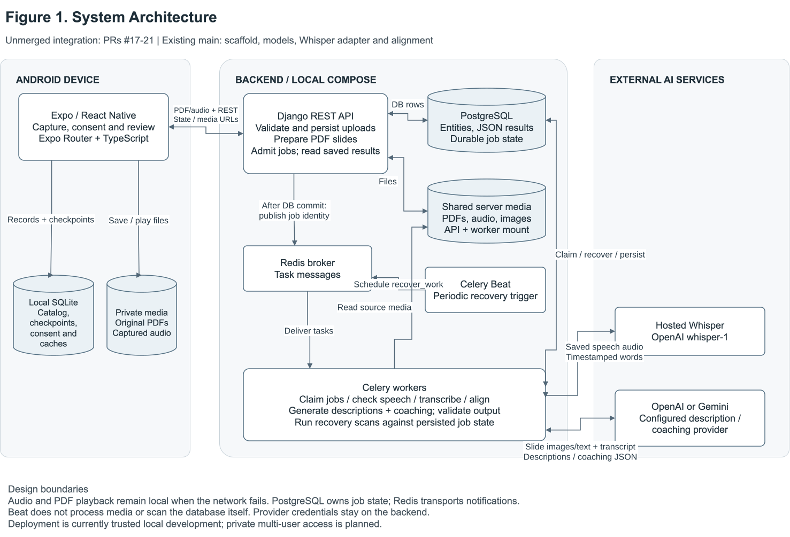
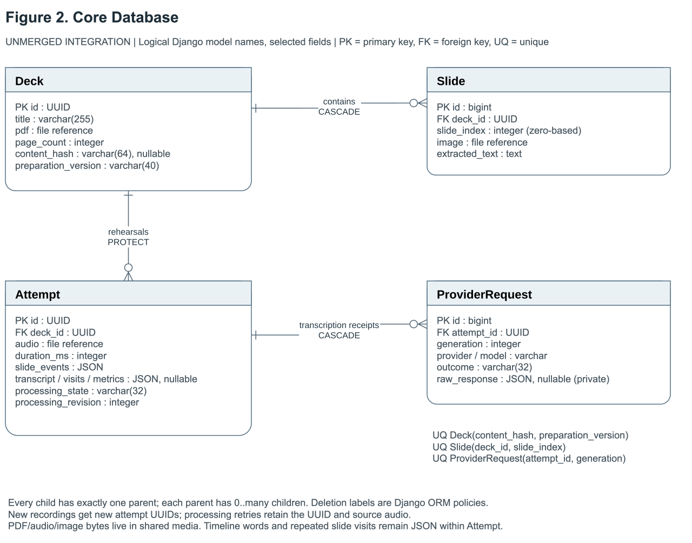
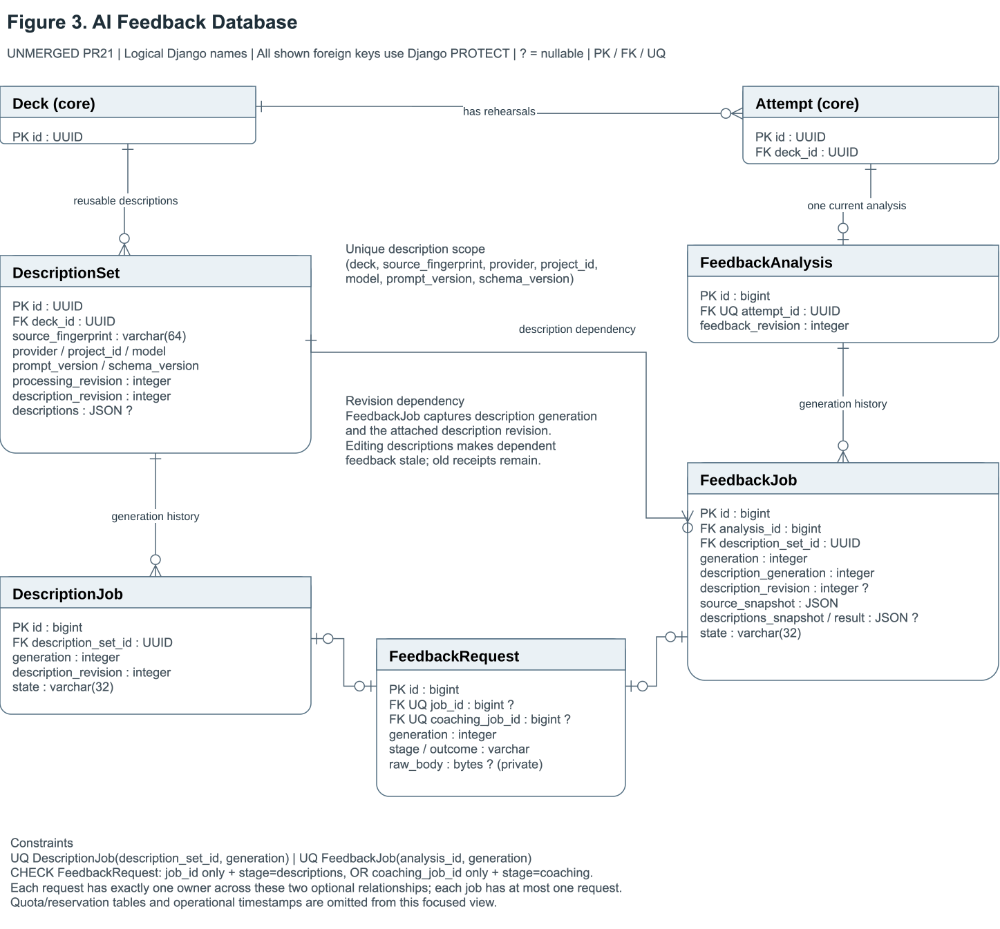
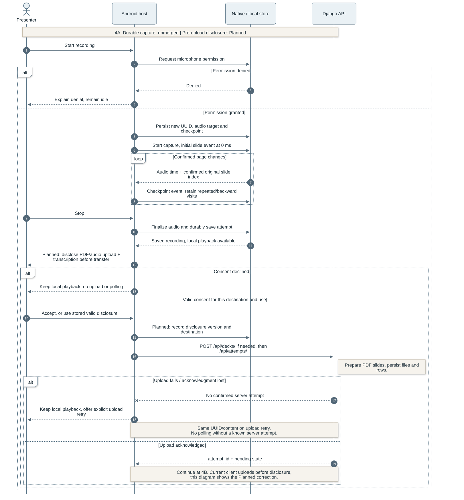
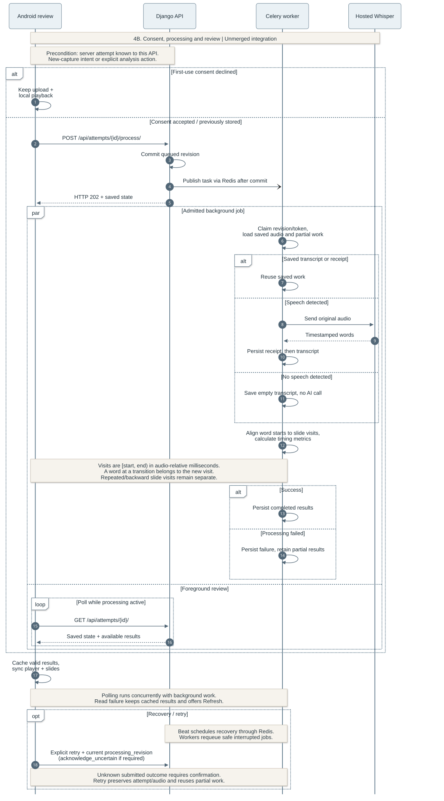
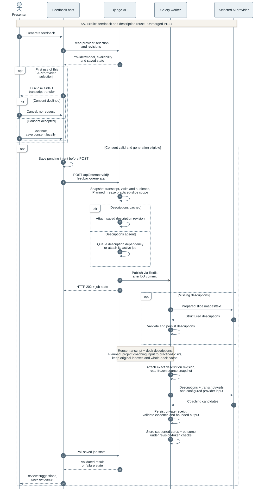
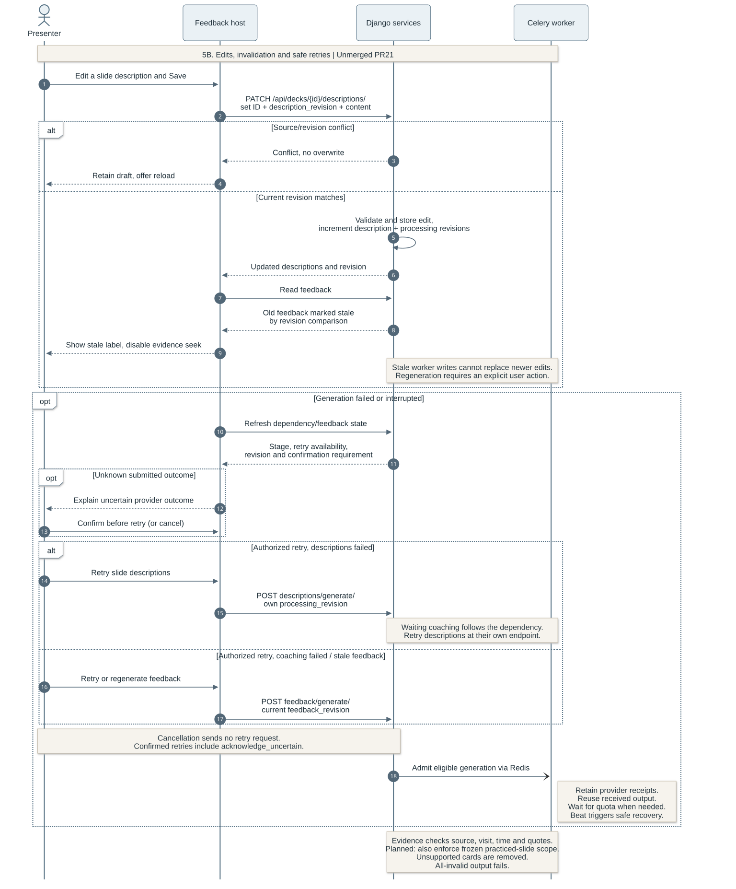
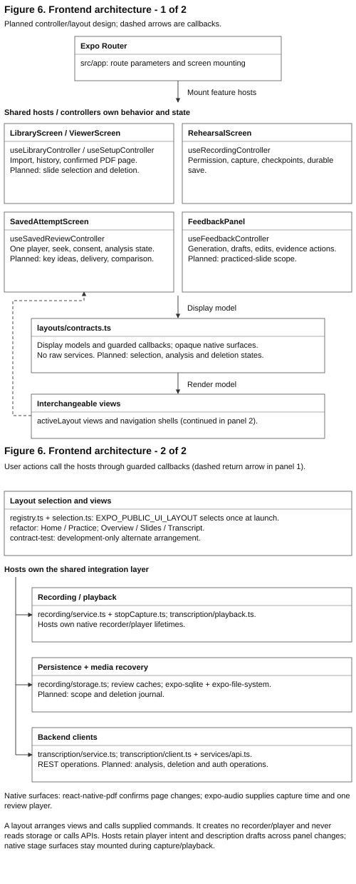

# OutLoud Design Documentation

Team 07 | Rev.4.0 | 9 October 2026

OutLoud is an Android presentation-rehearsal app. Presenters import PDF slides, record a rehearsal, and review their speech alongside the slides they visited. The design combines local recording and playback with server-side transcription and optional, user-requested AI coaching.

## 1. Document Revision History

| Version | Date | Description |
| --- | --- | --- |
| Rev.1.0 | 2026-09-28 | Initial architecture, data model and processing design. |
| Rev.2.0 | 2026-10-09 | Expanded recording, persistence, transcription, review and feedback design. |
| Rev.3.0 | 2026-10-09 | Added architecture and workflow diagrams; clarified component responsibilities and design rationale. |
| Rev.4.0 | 2026-10-09 | Reorganized around seven design sections; simplified API and recovery explanations; removed implementation tracking and references. |

### Contents

- [2. System Architecture](#2-system-architecture)
- [3. Database Design](#3-database-design)
- [4. Backend and API Design](#4-backend-and-api-design)
- [5. Recording, Transcription, and Slide Alignment](#5-recording-transcription-and-slide-alignment)
- [6. AI Feedback Design](#6-ai-feedback-design)
- [7. Frontend Architecture](#7-frontend-architecture)

## 2. System Architecture

**Figure 1. System Architecture.**

OutLoud uses a client-server architecture with separate responsibilities for capture, storage and analysis. The Android application handles PDF navigation, microphone recording and playback. The application imports PDF presentations and sends them to the backend for slide preparation. Rehearsal audio is saved locally before being uploaded with its corresponding slide-transition timestamps. Django prepares uploaded PDFs, stores rehearsals and accepts processing requests. The client retrieves progress and results through REST polling.

Celery workers perform transcription and feedback generation outside HTTP requests. Redis carries task messages, while PostgreSQL holds durable job state and results. The API and workers access the same server media volume, allowing workers to read uploaded files without transferring them through the queue. Celery Beat schedules recovery tasks that workers use to resume interrupted processing.

| Component | Technologies | Responsibility |
| --- | --- | --- |
| Android application | Expo, React Native, TypeScript, Expo Router | Navigation, feature state and screen rendering. |
| Device integrations | `react-native-pdf`, `expo-audio`, `expo-document-picker`, `expo-file-system`, `expo-sqlite` | PDF display, recording/playback, private files and local metadata. |
| Backend | Django REST Framework, Celery, Redis | HTTP interfaces, background processing and task delivery. |
| Media processing | pypdfium2, pypdf, Pillow; PyAV, Silero VAD with ONNX Runtime | Slide images/text, audio decoding and speech-presence detection. |
| AI providers | Hosted OpenAI Whisper; OpenAI or Gemini feedback APIs | Word-timestamped transcription, slide descriptions and coaching. |
| Server persistence | PostgreSQL and shared media storage | Relational data, structured results, jobs and media files. |

Local recording lets presenters rehearse and replay audio during network failures. Hosted inference avoids an on-device transcription model and keeps provider credentials on the backend, but introduces network dependence, latency and service cost. Whisper receives rehearsal audio; the selected feedback provider receives slide content and transcript context.

REST polling allows review to resume from saved state after the app closes. Compared with WebSockets, it requires less connection management at the cost of extra requests and delayed progress updates. Persisting jobs before queue delivery allows recovery when a notification is lost; revision checks prevent older background work from replacing newer results.

## 3. Database Design

### Core rehearsal data

**Figure 2. Core Database ER Diagram.**

A **Deck** represents a PDF presentation and owns an ordered collection of **Slides**. Each slide belongs to one deck, with a unique slide index within that deck. The PDF content hash and preparation version identify reusable slide preparation. One deck supports many **Attempts**, each representing a separate rehearsal with its own audio, duration, audience and slide timeline.

A new recording receives a new attempt UUID. Upload and processing retries retain that identity and its source audio, keeping retries within the same rehearsal. Deck references on attempts prevent deletion of a presentation that still has dependent rehearsals; slides belong to their deck's lifecycle.

Attempt stores slide events, transcript words, chronological visits and metrics as JSON. Review reads these structures together, so JSON avoids separate word and visit tables while preserving the complete timeline. This simplifies retrieval but requires service-level validation of structure and timing. Database file fields point to PDFs, audio and slide images in media storage. **ProviderRequest** associates a saved transcription response with an attempt's processing generation, supporting recovery without repeating completed inference.

### Slide descriptions and feedback

**Figure 3. AI Feedback Database ER Diagram.**

The feedback model separates reusable presentation knowledge from rehearsal-specific advice. A deck can have multiple **DescriptionSets**, distinguished by slide content and provider configuration, including model, prompt and schema versions. Each set holds descriptions and owns its **DescriptionJobs**. This prevents incompatible inputs from sharing cached descriptions.

An attempt has at most one **FeedbackAnalysis**, which groups successive **FeedbackJobs**. Each feedback job references a description set and retains the transcript context and description revision used to generate advice. **FeedbackRequest** belongs to either a description job or a feedback job and retains its provider response. These relationships preserve generation history and allow failed stages to recover independently.

Content revisions connect editable descriptions to dependent coaching. Changing a description makes advice based on the earlier revision stale. Retaining the previous generation supports traceability while regeneration produces advice from the updated content.

### Local and server storage

The device stores PDFs and recordings in app-private files. SQLite holds JSON records for the local catalog, capture checkpoints and cached review data. PostgreSQL remains authoritative for server jobs and generated results. Separating these stores keeps saved audio available offline while allowing analysis to continue on the server. Local checkpoints help recover interrupted capture when the native audio file remains playable.

## 4. Backend and API Design

The backend separates HTTP handling from domain services. Views validate requests and serialize public results; services manage storage, transcription, alignment, descriptions and coaching. Celery tasks invoke those services for background work. PDF preparation occurs during deck upload, while external AI calls run outside HTTP requests and database transactions.

All routes use the `/api/` prefix and trailing slashes. Paths below are relative to that prefix.

| API group | Main routes | Responsibility |
| --- | --- | --- |
| Decks | POST `decks/`; GET `decks/{id}/` | Prepare/store PDFs and retrieve slide metadata. |
| Attempts | POST `attempts/`; GET `attempts/{id}/`; GET `decks/{id}/attempts/` | Store recordings, retrieve results and list rehearsal history. |
| Transcription | POST `attempts/{id}/process/` | Request transcription/alignment or retry processing. |
| Descriptions | GET/PATCH `decks/{id}/descriptions/`; POST `decks/{id}/descriptions/generate/` | Read, edit and generate reusable slide descriptions. |
| Coaching | GET `attempts/{id}/feedback/`; POST `attempts/{id}/feedback/generate/` | Retrieve feedback or request coaching. |
| Operations | GET `health/`; GET `ready/` | Check API liveness and database/broker connectivity. |

Recording upload uses multipart audio and JSON metadata containing the attempt identity, deck, duration, audience and slide events. Public interfaces use zero-based slide indexes and integer milliseconds relative to audio capture. TypeScript contracts and client validation connect these responses to frontend state.

Upload and processing are separate operations: storing a rehearsal preserves its media even if analysis fails. Read requests return saved state without starting generation. Background results expose progress, available data and retry eligibility, allowing review to display useful partial results and refresh server state after a connection failure.

## 5. Recording, Transcription, and Slide Alignment

**Figure 4A. Recording and Durable Upload.**

The recording controller obtains microphone permission and starts an audio timeline with an initial slide event at zero. During capture, confirmed PDF page changes record the slide index and elapsed native audio time. Using audio-relative timestamps keeps navigation and speech aligned regardless of network delay or device clock changes.

Stopping a rehearsal finalizes the audio file and saves its metadata before upload begins. If upload fails, local playback remains available and retry uses the same attempt identity. This ordering protects the recording independently of backend availability.

**Figure 4B. Transcription, Alignment and Review.**

After a rehearsal is completed, the application uploads the saved recording and automatically initiates transcription and slide alignment. Results are processed asynchronously and become available in the review interface. The API schedules background work, and the active review screen polls only after it knows a server attempt exists. Reopening a saved rehearsal retrieves existing state rather than repeating analysis.

The worker checks for speech before sending the original audio to hosted Whisper, which returns timestamped words. Recordings without detected speech retain their slide timeline with an empty transcript. The worker saves transcription before aligning words to slides, so a later alignment failure does not discard recognized speech. Recovery can reuse completed results; failures that need another provider call remain separate from local playback.

### Word-start alignment and synchronized review

Slide events define chronological visits with half-open intervals `[start_ms, end_ms)`. The final visit ends at the recording duration. Each word belongs to the visit containing its **start time**. A binary search selects the latest transition at or before that time, assigning an exact-boundary word to the new visit.

For example, transitions to slides 0, 1 and 0 at 0, 4000 and 9000 ms produce three visits. A word starting at 4000 ms belongs to slide 1; one starting at 9000 ms belongs to the second visit to slide 0. Repeated and backward visits remain distinct, and the last event wins when transitions share a timestamp. A word crossing a transition stays intact in its starting visit.

This rule gives each word a deterministic place in the recorded navigation. During review, one native player's audio position drives slide selection and transcript highlighting. Tapping a word or feedback citation seeks that same player to the corresponding time. Recorded slide events still support synchronized slide playback when aligned text is unavailable.

## 6. AI Feedback Design

**Figure 5A. Feedback Generation and Description Reuse.**

AI coaching starts when the user requests feedback from a saved rehearsal. It uses the existing transcript, slide visits and audience context without transcribing the audio again. The backend attaches compatible cached descriptions or generates them before coaching. Slide descriptions interpret images and extracted text; they describe presentation content rather than summarize what the presenter said.

Separating descriptions from coaching avoids interpreting unchanged slides for every rehearsal. The cache accounts for both source content and generation configuration, trading additional version management for lower latency and fewer provider calls. Backend provider adapters support OpenAI or Gemini through a common service boundary, keeping provider-specific requests out of the app.

Coaching produces suggestions about consistency, clarity and audience fit. Each suggestion links slide evidence to a passage within one recorded visit. The backend validates source identities, transcript quotations and word positions, then derives playback times from the saved transcript. The client checks that evidence belongs to the loaded rehearsal before enabling navigation. These checks establish traceability; they do not guarantee that the advice is semantically correct. Feedback is validated against the original slide content and transcript to ensure suggestions can be traced to supporting evidence. A valid response can also contain no suggestions.

**Figure 5B. Description Edits, Invalidation and Retry.**

Users can correct slide descriptions before requesting new advice. An edit creates a newer content revision, prevents older generation work from overwriting it, and makes dependent feedback stale. The interface disables stale evidence actions until regeneration. This keeps editable presentation knowledge consistent with the coaching that relies on it.

Description generation and coaching retain separate job state, allowing a retry to reuse successful earlier work. Saved provider responses support recovery where possible. If a submitted request has an uncertain outcome, retry requires confirmation to avoid silently repeating a potentially completed, chargeable operation. Feedback failure leaves the rehearsal audio and transcript available for review.

## 7. Frontend Architecture

**Figure 6. Frontend Architecture.**

The frontend separates navigation, feature behavior and presentation. Expo Router passes route context to feature hosts. Their controllers own application state and coordinate recording, playback, persistence and API clients. Replaceable layouts render the state and invoke controller-provided actions. This separation allows the interface to evolve without duplicating the underlying rehearsal behavior.

| Feature controller | Owned state and behavior |
| --- | --- |
| Library | PDF import, presentation catalog and rehearsal history. |
| Setup | Selected deck/page, audience and readiness to record. |
| Recording | Microphone lifecycle, slide timing and durable save. |
| Saved review | Shared playback, transcript state and analysis requests. |
| Feedback | Generation progress, description drafts and evidence navigation. |

Home emphasizes importing and opening presentations; Practice groups saved attempts by deck. Saved review offers Overview, Slides and Transcript panels around a shared player. Playback and feedback state belong to the review host, so changing panels preserves the audio position and description drafts. Feedback evidence opens the relevant slide and seeks through the same playback controls used by the transcript.

Typed layout contracts expose display models, available actions and native PDF/audio surfaces. Layouts do not own recorder, player, storage or network clients. A layout selection at startup connects views to the same feature hosts; keeping native surfaces mounted preserves active capture and playback during view updates.

Shared services handle local persistence and backend communication beneath the controllers. Native libraries provide PDF and audio capabilities through these boundaries. The design requires maintaining contracts as features change, but confines visual changes to views and keeps lifecycle and recovery behavior in one place.
