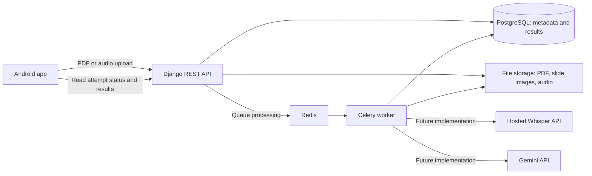

# OutLoud setup explained

This is a walkthrough of the work done to prepare Team 07's shared Iteration 1 project. It explains the code, local environment, verification, and Git state so you can review the setup and explain it to your teammates.

**Current scope:** a shared application scaffold with screen frames and integration contracts. Your teammates still implement PDF import/viewing, real recording, Whisper transcription, slide matching, and initial Gemini feedback. The scaffold was shown locally before publication, and you subsequently approved its upload to GitHub.

## 1. What I used as the requirements

I read the submitted `Team07_Final_Proposal.pdf`, `team07_tasks.pdf`, and `team07_schedule.xlsx`. They specify:

- An Android app using Expo, React Native, and TypeScript.
- A Python/Django REST backend.
- PostgreSQL, file storage, and a background worker.
- Hosted OpenAI `whisper-1` with word timestamps.
- Initial Gemini slide-image feedback in Iteration 1.

The complete Iteration 1 target is PDF → recording → transcription → slide matching → feedback. That is why the scaffold has a feedback entry point even though the main teammate workstreams you named were PDF, recording, and Whisper.

I ignored placeholder effort/hour values as you requested. I did not edit the submitted documents, change team assignments, or treat the older `OnLoud-schedule-to-copy.md` as the current specification. The exact source-to-code mapping is in [source-alignment.md](source-alignment.md).

## 2. Why this is an Android Studio setup with TypeScript

Android Studio supplies the Android SDK, emulator, Gradle integration, and tools to build/install the app. The application screens and feature logic are written in **TypeScript and React Native**, following the proposal.

Expo configures the native project from `mobile/app.json` and installed libraries. Running `npm run prebuild:android` generates `mobile/android`, which Android Studio can open. Running `npm run android` also builds and installs the development app.

You and your teammates will usually edit `mobile/src`, not generated Kotlin or Java files. Changes that affect native configuration should go through Expo configuration or config plugins so everyone can reproduce the Android project.

Three development tools have different jobs:

| Tool | What it does here |
| --- | --- |
| Expo | Configures the app and connects JavaScript/native development tools |
| Gradle | Compiles native Android code and packages the APK |
| Metro | Serves the JavaScript code to the development app while you work |

The scaffold uses local development builds. No EAS cloud account, store submission, or production release configuration has been set up.

## 3. How the pieces will connect



The API handles app requests. The worker will do slower processing without keeping one HTTP request open for the entire transcription/analysis. PostgreSQL stores structured records; the media volume stores file contents. Redis transports work to Celery.

**What works now:** the Android emulator app reached the Docker API and displayed **Connected to OutLoud backend**. The database, Redis, worker connectivity, and shared file storage have also been verified. **What remains:** the upload and processing arrows are documented interfaces and stubs. They do not yet implement this full workflow.

## 4. Repository structure

```text
README.md                         Team setup and run commands
compose.yaml                      Local backend services
.github/workflows/checks.yml       Checks to run on GitHub
.github/pull_request_template.md   Teammate review template
docs/                             Contracts, handoff, review, this guide

mobile/
  app.json                        Expo/Android configuration
  package.json                    Dependencies and development commands
  package-lock.json               Reproducible JavaScript dependency versions
  src/app/                        Small navigation route files
  src/features/pdf/               Library and slide-viewer workstream
  src/features/recording/          Recording/slide-tracking workstream
  src/features/transcription/     Transcript/result workstream
  src/contracts/                  Shared TypeScript data shapes
  src/services/                   Backend connection and explicit stub errors
  src/fixtures/                   Hand-written sample content
  src/ui/                         Shared screen, card, button, and styles

backend/
  manage.py                       Django command entry point
  requirements.in                 Direct Python dependency constraints
  requirements.txt                Resolved Python dependency versions
  config/                         Django and Celery configuration
  rehearsals/models.py            Deck, Slide, and Attempt database models
  rehearsals/migrations/          Initial database schema
  rehearsals/serializers.py       Attempt-metadata validation
  rehearsals/views.py             Health/readiness and unfinished-route responses
  rehearsals/urls.py              API paths
  rehearsals/tasks.py             Background-processing entry point
  rehearsals/services/            PDF, Whisper, matching, Gemini entry points
  rehearsals/tests.py             Five foundation tests
```

The repository is one shared project containing both mobile and backend code. A teammate branch can change both sides of its feature without needing a separate repository or a separately versioned package.

## 5. What the four screen frames do

| Screen | Implemented in the frame | Still to implement |
| --- | --- | --- |
| Library | Sample presentation, navigation, real backend connection button, clear import-not-implemented message | PDF picker, persistent file access, upload, real library data |
| Slide viewer | Three sample slides, previous/next boundaries, optional audience input | Rendering imported PDF pages and using real deck/slide IDs |
| Rehearsal | Current sample slide, navigation, audience context, layout for recording controls | Microphone permission, audio capture, clock, event tracking, saved audio |
| Review | Hand-written transcript/feedback samples and processing/failure previews | Real result polling, word timing, audio replay, feedback evidence and retry |

The demo content is explicitly labeled. The recording button is disabled, the timer stays at `00:00`, and no microphone capture is claimed. Result-state buttons only change which screen state you preview; they do not submit an AI request.

Navigation lives in [the route layout](../mobile/src/app/_layout.tsx). The actual screens live in their feature directories. This lets a teammate edit a screen without having to maintain all of the navigation code.

The shared UI file provides colors, spacing, cards, buttons, scrollable screens, and safe-area handling. The visual design is a starting frame for implementation, not a finalized product design.

## 6. Interfaces let teammates work independently

An interface defines what a feature will provide without implementing it yet. For example, [RecordingService](../mobile/src/features/recording/service.ts) requires:

```ts
export interface RecordingService {
  start(deckId: string, initialSlideIndex: number, audience: string): Promise<void>;
  onSlideChanged(slideIndex: number): void;
  stop(): Promise<LocalRecording>;
  cancel(): Promise<void>;
}
```

The recording teammate decides how to use `expo-audio` inside those methods. The integration teammate can depend on the resulting `LocalRecording` shape without knowing every recording detail.

Similarly:

- `PdfService.importPdf()` will return the imported deck and prepared slides, or `null` if the user cancels the picker.
- `TranscriptionService` describes submitting a recording, reading its result, and retrying processing.
- Backend functions `prepare_slides`, `transcribe`, `align_words`, and `analyze_slide` identify where each processing implementation belongs.

These entry points are deliberately unfinished. Backend adapters and the PDF service throw explicit not-implemented errors. Feature HTTP routes return **501 Not Implemented**. This keeps a missing feature distinguishable from successful processing.

## 7. The shared data and timing agreement

The definitions in [mobile/src/contracts/index.ts](../mobile/src/contracts/index.ts) agree with [api-contract.md](api-contract.md).

| Data | Meaning |
| --- | --- |
| `Deck` | One uploaded presentation, identified by a stable ID |
| `Slide` | One page of a particular deck, with image and extracted text |
| `SlideEvent` | Which slide became visible at a particular audio timestamp |
| `LocalRecording` | Attempt metadata plus the local audio-file URI |
| `TranscriptWord` | A word and its start/end times |
| `AttemptResult` | Processing status, transcript, feedback, or a failure |

Important conventions are already written down:

- Slide indexes start at **0 in code** and are displayed as **1, 2, 3…** to users.
- Times are **integer milliseconds relative to the captured audio**, not clock/calendar time.
- Log the first visible slide at `0` ms.
- Preserve backward/repeated visits. A slide can have multiple separate speaking intervals.
- Give every new recording its own attempt ID. A processing retry keeps the existing ID and recording.

For example, events `(slide 0, 0 ms)`, `(slide 1, 4000 ms)`, `(slide 0, 9000 ms)` describe three visits, not two slides to sort or deduplicate. For a 12-second recording, those visits cover `[0,4000)`, `[4000,9000)`, and `[9000,12000)`.

The initial matching policy assigns a word according to its start time. A word starting exactly at `4000` ms belongs to the newly displayed slide 1. This policy is documented for implementation and testing; the alignment function itself is not implemented yet.

## 8. What the backend setup contains

### Database models

`Deck` stores presentation metadata and a PDF file reference. `Slide` belongs to a deck and stores its page index, rendered-image reference, and extracted text. A uniqueness constraint prevents two slide records having the same index within the same deck.

`Attempt` belongs to a deck and stores the audio reference, duration, slide events, optional audience, processing status, transcript, feedback, and error. It has a separate UUID for every recording. PostgreSQL stores these records; it does not contain the PDF/audio bytes themselves.

A Django **migration** is a version-controlled instruction for creating or changing database tables. I generated the initial migration and verified that the models do not require another migration. Teammates should coordinate future model/migration changes.

### API paths

| Path | Current behavior |
| --- | --- |
| `GET /api/health/` | Returns 200 when the API process responds |
| `GET /api/ready/` | Checks database/Redis connectivity; returns 200 or 503 |
| `/api/decks/` | 501 placeholder for PDF upload/preparation |
| `/api/attempts/` | 501 placeholder for audio upload/attempt creation |
| `/api/attempts/{id}/` | 501 placeholder for reading results |
| `/api/attempts/{id}/process/` | 501 placeholder for background processing/retry |

Health is a small liveness check, not proof that every dependency works. Readiness checks PostgreSQL and Redis but does not check a worker, so I separately verified Celery's response through Redis.

### Worker and AI boundaries

Celery is configured and can receive control messages. Its `process_attempt` task still raises `NotImplementedError`. The implementation will eventually load saved audio, call Whisper, align words, call Gemini, and save the result/status. A responsive worker is not proof of a completed AI pipeline.

Provider credentials belong on the backend. The mobile app will call your API rather than containing an OpenAI/Gemini key. No provider keys were requested or used, and no paid AI requests were made during setup.

## 9. Docker and local configuration

After you installed Docker, I confirmed the engine was running and built/started these Compose services:

| Service | Purpose |
| --- | --- |
| `db` | PostgreSQL 16 for application records |
| `redis` | Redis 7 for the task broker |
| `api` | Django development server; applies migrations on startup |
| `worker` | Celery worker using the same backend code |

Two Docker volumes keep database and media contents outside an individual container. The API and worker share the same media volume. I verified that sharing by writing a temporary probe file in the API container, reading it in the worker container, and removing it afterward.

Ports bind to this computer's loopback address. This Compose setup is for local development. It is not a public deployment and does not include user authentication or production serving.

I created ignored `backend/.env` from `.env.example` because it was absent. It contains development settings and empty provider-key fields. If a real `.env` already existed, it would have been preserved. The committed example gives teammates the variable names without sharing private keys.

Inside Docker, the API finds PostgreSQL at hostname `db` and Redis at `redis`. On the Android emulator, `10.0.2.2` points to the host computer. That is why the app defaults to `http://10.0.2.2:8000/api`.

## 10. Tools installed or configured during setup

| Component | Setup used |
| --- | --- |
| Mobile | Official Expo blank TypeScript template; Expo SDK 57 and React Native 0.86.3 |
| Navigation | Expo Router, with four route files |
| Feature libraries | Expo audio, document picker, file system, and development client |
| Shared/native support | Safe-area, screens, linking, constants, compatible animation/worklet dependencies |
| JavaScript dependencies | `package-lock.json`; clean-install dry run verified |
| Python | Project-local `backend/.venv`, Python 3.12, pinned resolved requirements |
| Backend | Django 5.2.17, Django REST Framework, Celery, PostgreSQL driver, Redis client |
| Native build | Gradle 9.3.1; provisioned JDK 17 toolchain; Android SDK 36 and NDK 27.1.12297006 |
| Docker | Your installation; engine 29.8.0 and Compose 5.5.1 observed during verification |

The README recommends Node.js 24 LTS and records the minimum supported version. The existing local Node used during setup was 26.8.2. I did not replace your system Node installation.

The first native build downloads much more than later builds: Gradle, a Java toolchain, the NDK, and Android/React Native libraries. This is why JavaScript checks completed before APK compilation.

## 11. Setup issues and how they were handled

- The initial package-registry request was blocked by the execution sandbox. Downloads were retried through the approved network-enabled tool path.
- Expo's online compatibility-metadata request encountered a certificate-chain error. I used Expo's bundled SDK compatibility table for dependency selection. TLS verification was not disabled.
- Automatic peer resolution initially selected React DOM and worklet versions outside the intended SDK combination. I installed the versions from Expo 57's compatibility table, then verified the dependency check and lockfile dry run.
- The first local Django smoke server used the in-memory test settings because PostgreSQL was not yet available. After Docker installation, I stopped that server, started the real stack, and reran the tests against PostgreSQL.
- The native build had a long wait on dependency downloads. I resumed it with diagnostics, bounded HTTP timeouts, and two Gradle workers. This changed the verification command, not the project's source configuration.
- The first native compile then failed during Worklets/CMake setup with Android Studio's bundled Java 25 and a restricted-method warning. I switched the Gradle runtime to the downloaded JDK 17 and corrected the setup instructions. The retry completed successfully. [React Native's environment guide](https://reactnative.dev/docs/set-up-your-environment#java-development-kit) also recommends JDK 17.
- Dependency installation reported 13 moderate audit entries through Expo/Router dependencies. The proposed automatic fixes would downgrade major Expo/Router versions, so they were not applied blindly. See [review.md](review.md) for the recorded limitation.

## 12. What has actually been verified

| Check | Result | What it proves |
| --- | --- | --- |
| TypeScript | Passed | The mobile source satisfies its declared types |
| Expo lint | Passed | The configured source checks pass |
| SDK dependency check | Passed using the bundled table | Installed direct SDK dependencies match that table |
| `npm ci` dry run | Passed | Package manifest and lockfile resolve consistently; this is not a fresh full install |
| Android JS export | Passed, 1,251 modules | Metro can produce the Android JavaScript bundle |
| Expo Android prebuild | Passed | The native Android Studio project can be generated |
| Django system check | Passed | Django configuration passes its framework checks |
| Migration consistency | Passed | No ungenerated model changes |
| Five backend tests, SQLite | Passed | Foundation tests work without external services |
| Same five tests, PostgreSQL | Passed | Foundation tests also work against the intended database |
| Compose images and services | Passed | API/worker images build; all four services start |
| HTTP health/readiness | Both 200 against Docker stack | API, PostgreSQL, and Redis are reachable |
| Celery ping | One worker replied `pong` | Worker responds through the broker |
| Shared media probe | Passed and probe removed | API and worker access the same media storage |
| Native APK compilation | Passed for ARM64 with JDK 17 | Gradle packaged a debug Android APK |
| Android 36 ARM64 emulator | Installed and all four frames rendered | The native app launches and its sample navigation works |
| Emulator → Docker API | App displayed “Connected to OutLoud backend” | The real mobile HTTP health-check reaches Django |
| GitHub CI | Separate from this local verification snapshot | Consult the pull request's checks for remote results |

The five backend tests cover API liveness, honest 501 responses for unfinished features, preservation of repeated/simultaneous slide events, rejection of invalid timing metadata, and separate stored attempt identities. Running the same suite on two databases is **five distinct tests run twice**, not ten different feature tests.

The emulator smoke check covered the library, viewer, rehearsal, and review frames. I checked disabled navigation at the first/last slide, forward/backward slide changes, the selected slide passing into rehearsal, and audience text entered as `Team07 students` appearing there. Recording and playback controls stayed disabled as intended. This was a focused development-build check on the existing `Medium_Phone` emulator, not a physical-device or release-build test. The processing/failure previews exist in code; switching between those two states was not part of the completed emulator check.

The successful native build used this command from `mobile/android`, with JDK 17 and `ANDROID_HOME` selected as shown below:

```sh
./gradlew :app:assembleDebug -PreactNativeArchitectures=arm64-v8a --console=plain --max-workers=2
```

The generated APK is at `mobile/android/app/build/outputs/apk/debug/app-debug.apk`. It is ignored by Git and needs Metro for this development build. I installed it into the emulator, forwarded port 8081 with `adb reverse`, and opened the development client against the local Metro server. No APK was uploaded anywhere.

None of these results proves PDF rendering, microphone capture, Whisper accuracy, slide-alignment accuracy, or Gemini feedback quality. Those features remain for the team to implement and test with real material.

## 13. How to run this yourself

From the repository root, for the backend:

Docker's engine is installed and running on this Mac, but this shell did not initially find the `docker` command. I used Docker Desktop's bundled CLI with a temporary PATH prefix. If your terminal also says `docker: command not found`, run this first (macOS only):

```sh
export PATH="/Applications/Docker.app/Contents/Resources/bin:$PATH"
```

```sh
# First setup only: create backend/.env from backend/.env.example if absent.
docker compose up --build -d
docker compose ps
docker compose logs --tail=50 api worker
```

To rerun the checks against the running containers:

```sh
docker compose exec api python manage.py check
docker compose exec api python manage.py test --noinput
docker compose exec worker celery -A config inspect ping
```

For the mobile application:

Use **JDK 17** for both command-line builds and Android Studio's project Gradle JDK. On this Mac, Gradle downloaded it to this location; this command selects it for the current terminal without changing your system Java installation:

```sh
export JAVA_HOME="$HOME/.gradle/jdks/eclipse_adoptium-17-aarch64-os_x.2/jdk-17.0.20.1+1/Contents/Home"
export ANDROID_HOME="$HOME/Library/Android/sdk"
export PATH="$ANDROID_HOME/platform-tools:$PATH"
```

That JDK path is specific to the downloaded version on this machine. Teammates should select their own installed JDK 17; a macOS-registered installation can be selected with `export JAVA_HOME="$(/usr/libexec/java_home -v 17)"`.

```sh
cd mobile
npm ci
# Optional: create .env from .env.example to change the backend address.
# Start an emulator in Android Studio Device Manager.
npm run android
```

To open Android Studio directly:

```sh
cd mobile
npm run prebuild:android
# Open the generated mobile/android directory in Android Studio.
npm start
```

Keep Metro running for a development build. Use the Library screen's **Check connection** button to reach the backend. A USB phone can use `adb reverse tcp:8000 tcp:8000` with the API address set to `http://127.0.0.1:8000/api`.

To stop the backend without deleting its saved volumes:

```sh
docker compose stop
```

Do not use `docker compose down -v` unless you intend to delete this project's stored database/media volumes.

## 14. Exactly what happened with Git

1. I inspected the supplied GitHub repository read-only. It contained the course README template at commit `191e80d070d05c1e89fbe464767102c4a1fde4f7`.
2. I set the local `origin` to `https://github.com/snuhcs-course/swpp-2026-project-team-07.git` and fetched its `main` branch.
3. I created local branch `codex/iteration-1-scaffold` from that existing history, preserving the local files.
4. I replaced the template README locally and staged the scaffold files so you can review the complete diff.
5. I stopped before committing or pushing so you could review it. You then said everything looked good and explicitly authorized the push.
6. The publication uses `codex/iteration-1-scaffold` and a pull request into `main`. Teammates can branch from the scaffold branch immediately; after the PR is merged, they can start from `main`. See [team-work-division.md](team-work-division.md) for both commands.

**Staging** selects local changes for review or a future commit. **Committing** records a snapshot locally. **Pushing** sends committed history to GitHub. A **pull request** proposes merging that branch into `main`; publishing a branch does not itself merge it.

Ignored/unpublished content includes installed dependencies, Python virtual environments, generated Android code, build output, `.env` files, and media. The earlier schedule-copy draft remains untracked and excluded from the proposed scaffold upload. The submitted PDF/XLSX files were not copied into the application repository.

I also added a PR template and a GitHub Actions workflow for mobile checks and backend tests with PostgreSQL. These files do not configure branch protection, add collaborators, or run CI until the code is uploaded. GitHub access for teammates remains governed by the course repository.

## 15. How your teammates continue

Everyone starts from the same approved scaffold baseline:

| Branch example | Primary implementation area |
| --- | --- |
| `feature/pdf-viewer` | PDF service, library/viewer screens, backend PDF preparation |
| `feature/recording-tracking` | Recording service, microphone lifecycle, persistent audio, slide events |
| `feature/whisper-alignment` | Audio submission, Whisper adapter, timing normalization, matching, result screen |
| `feature/prototype-integration` | Upload handlers, worker orchestration, Gemini feedback, evidence checks |

The recommended division is three feature owners plus you as the integration owner, if there are four people in total. These are proposed responsibilities, not named assignments. [team-work-division.md](team-work-division.md) gives the detailed work packages and an option for a three-person team. Agree on changes to shared types, models/migrations, and dependency locks before merging so one feature does not silently break another.

Read [iteration-1-handoff.md](iteration-1-handoff.md) for the implementation boundaries and [api-contract.md](api-contract.md) for request/result shapes. The first complete feature demonstration should use a short real PDF and recording, including forward/backward slide changes, then real transcription and feedback with checked evidence references.

For reviewing the code now, follow [review.md](review.md). For everyday commands, use the [README](../README.md).
